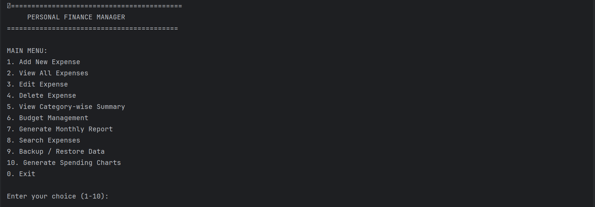
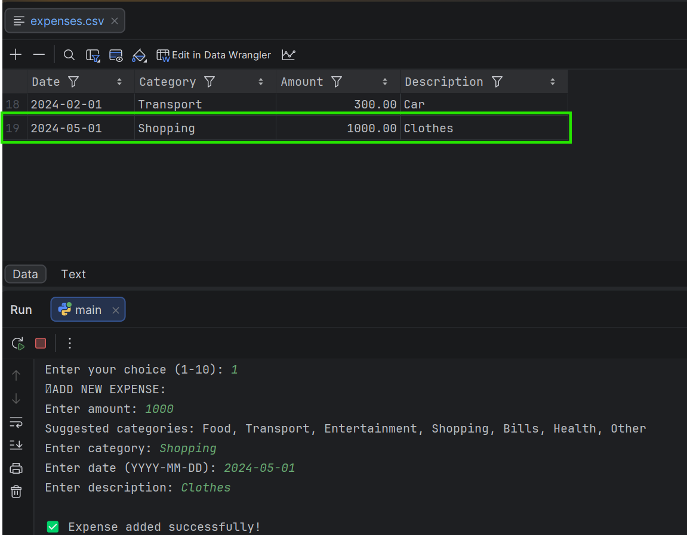
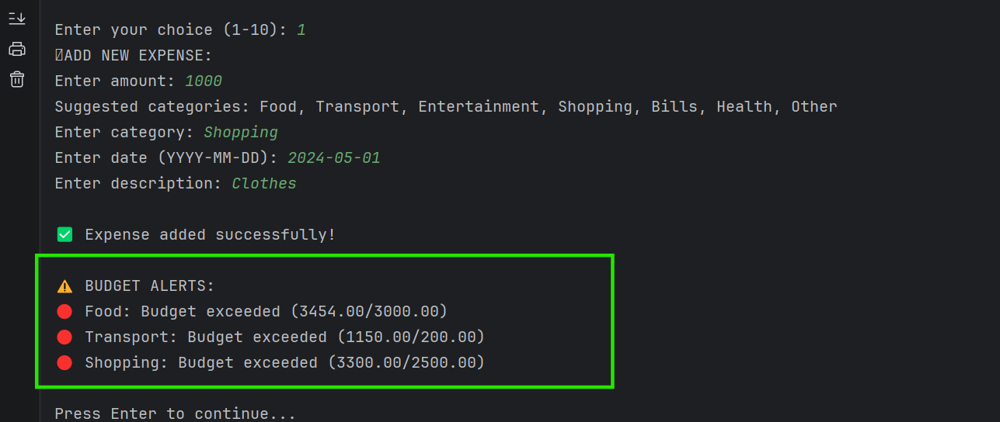
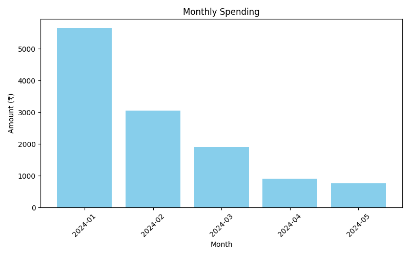

---

# 💰 Personal Finance Manager (Python CLI Application)


---

## 📌 Project Overview 

**Personal Finance Manager** is a complete, modular, and production-ready **Python command-line application** designed to help users **track expenses, manage budgets, generate reports, visualize spending trends, and maintain financial discipline**.

This project demonstrates:

* Object-Oriented Programming (OOP)
* File handling & persistence (CSV & JSON)
* Data validation & error handling
* Reporting & visualization using `matplotlib`
* Unit testing using `pytest`
* Dockerized deployment
* Clean, scalable architecture

---

## 🎯 Key Features

### 🧾 Expense Management

* Add new expenses with validation
* Edit existing expense records
* Delete expenses with confirmation
* Persistent storage using CSV files

### 📊 Reports & Analytics

* Category-wise expense summary 📊
* Monthly expense reports 📅
* Total & average expense calculations 💰

### 📈 Visual Charts (Auto-Saved as PNG)

* Category-wise spending chart
* Monthly spending trend
* Budget vs Actual comparison

📁 Charts are saved automatically in:

```
reports/
```

### 💸 Budget Management

* Set category-wise monthly budgets
* Delete or update budgets
* Real-time alerts when:

  * Budget exceeds
  * Budget reaches warning threshold

### 📌 Architecture Style

Modular, Layered CLI Application
```
Presentation Layer  → menu.py
Business Logic      → expense.py, budget_manager.py, reports.py
Data Persistence    → file_manager.py
Utilities / Helpers → utils.py
Entry Point         → main.py
```

### 🧠 Core Data Structures Used
| Component | Data Structure     | Why                              |
|-----------|--------------------|----------------------------------|
| Expenses  | `list[Expense]`    | Ordered, iterable, easy CRUD     |
| Expense   | Class (OOP)        | Encapsulation of data & behavior |
| Budgets   | `dict[str, float]` | Fast category lookup             |
| CSV       | Row-based storage  | Simple persistence               |
| Charts    | Aggregated dicts   | Matplotlib compatibility         |


### 🧮 Algorithms Used (Simple & Effective)

| Feature          | Algorithm                |
|------------------|--------------------------|
| Expense total    | Linear scan `O(n)`       |
| Category summary | Hash map aggregation     |
| Monthly filter   | String prefix match      |
| Budget alerts    | Threshold comparison     |
| Search           | Linear filtering         |
| Backup           | File copy with timestamp |


### 🔔 Smart Alerts

* 🔴 Budget exceeded alerts
* 🟡 Budget nearing limit alerts
* Displayed immediately after adding expenses

### 🔍 Search Functionality

* Search by date
* Search by category
* Search by amount range
* Keyword-based search

### 🧪 Testing

* Unit tests for:

  * Validation logic
  * File handling
  * Budget calculations
* Automated testing using `pytest`


### 🐳 Docker Support

* Fully containerized application
* Reproducible environment
* One-command execution

---

## 🏗 Project Architecture

```
Finance_Manager/
│
├── src/
│   ├── main.py                 # Application entry point
│   ├── menu.py                 # CLI menu system & flow control
│   ├── expense.py              # Expense class (OOP model)
│   ├── file_manager.py         # CSV backup, restore & persistence
│   ├── budget_manager.py       # Budget logic & alerts
│   ├── reports.py              # Reports & chart generation
│   └── utils.py                # Validation & helper utilities
│
├── charts/
│   ├── *category_spending.png
│   ├── *monthly_spending.png
│   └── *budget_vs_actual.png
├── data/
│   ├── expenses.csv        # Expense data
│   └── budgets.json        # Budget data
│
├── backups/
│   └── *expenses_backup.csv
│
├── reports/
│   └── report_****-**.csv
│
├── tests/
│   ├── test_utils.py
│   ├── test_file_manager.py
│   ├── test_budget_manager.py
│   └── test_expense_manager.py
│
├── Dockerfile
├── requirements.txt
├── README.md
└── .dockerignore
```

---

## ⚙️ Installation & Setup

### 🔹 Prerequisites

* Python **3.10+**
* pip
* Git (optional)
* Docker (optional)

---

### 🔹 Local Setup

```bash
git clone <your-github-repo-url>
cd Finance_Manager
pip install -r requirements.txt
python main.py
```

---

### 🔹 Docker Setup (Recommended)

```bash
docker build -t finance-manager .
docker run -it finance-manager
```

✅ Ensures consistent execution across all environments.

---

## 🖥 Application Usage

### 🧭 Main Menu

```
1. Add New Expense
2. View All Expenses
3. Edit Expense
4. Delete Expense
5. View Category-wise Summary
6. Budget Management
7. Generate Monthly Report
8. Search Expenses
9. Backup / Restore Data
10. Generate Spending Charts
0. Exit
```

---

## 📊 Charts & Visualizations

Charts are generated using **matplotlib** and saved automatically.

### Available Charts:

* 📊 Category Spending
* 📅 Monthly Spending Trend
* 💰 Budget vs Actual

📁 Location:

```
charts/
```

### 🖼 Screenshot Suggestions (Add to GitHub)

Added to below folder:

```
screenshots/
```

### 📸 Application Screenshots

| Main Menu                                  | Add Expense                                    | Budget Alerts                                    |
|--------------------------------------------|------------------------------------------------|--------------------------------------------------|
|  |  |  |

| Category Spending                                          | Monthly Spending                                         | Budget vs Actual                                         |
|------------------------------------------------------------|----------------------------------------------------------|----------------------------------------------------------|
|  |  |  |

---
## 🧪 Testing

Run all unit tests:

```bash
pytest -v
```

✔ Covers:

* Input validation
* File persistence
* Budget logic
* Expense operations

---

## 🔐 Error Handling & Validation

* Invalid inputs handled gracefully
* No crashes on user mistakes
* Clear error messages
* Safe file operations

---

## 🧠 Technical Highlights

* OOP design with clean separation of concerns
* Modular and extensible codebase
* CSV + JSON data persistence
* Industry-standard testing approach
* Dockerized for deployment

---

## 🚀 Future Enhancements

* GUI version (Tkinter / Streamlit)
* Cloud sync
* Multi-user support
* Database backend (SQLite/PostgreSQL)
* Data export (Excel / PDF)

---

## 👤 Author

**Rahul Mahakal**
* 🎓 BCA – Amity University
* 💡 Python | Data Science | AI/ML Projects

---

## ⭐ Why This Project Matters

This project demonstrates **real-world Python engineering skills**, not just scripting:

* Architecture
* Testing
* Deployment
* Documentation
* Visualization

📌 This project was built as a complete end-to-end Python application to demonstrate real-world software engineering practices.

---

## 📜 License

This project is open-source and free to use for learning and portfolio purposes.

---